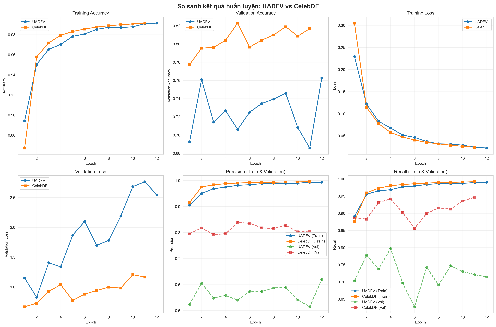
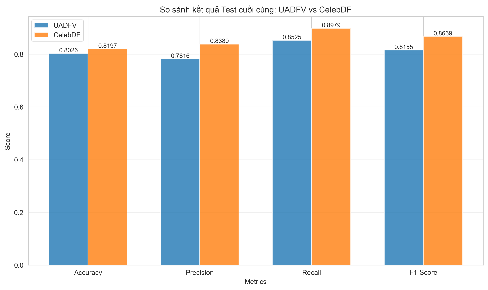

# DFT-MF: Phát hiện Deepfake bằng Phân tích Đặc trưng Vùng Miệng

Hệ thống phát hiện video deepfake sử dụng CNN và phân tích vùng miệng mở.

## 📁 Cấu trúc Thư mục

```
DFT-MF/
├── dataset/                  # Dataset storage
│   ├── UADFV/               # UADFV dataset
│   │   ├── fake/            # Fake videos
│   │   ├── real/            # Real videos
│   │   ├── frames/          # Pre-extracted frames
│   │   └── landmarks/       # Face landmarks
│   └── Celeb-DF/            # CelebDF dataset
├── UADFV/                   # UADFV processing structure
│   ├── ExtractFrams/        # Extracted frames
│   │   ├── fake_0000/
│   │   ├── fake_0001/
│   │   ├── real_0000/
│   │   └── real_0001/
│   ├── CroppedMouth/        # Cropped mouth regions
│   │   ├── fake_0000/
│   │   ├── fake_0001/
│   │   ├── real_0000/
│   │   └── real_0001/
│   └── Result.xlsx          # Detection results
├── CelebDF/                 # CelebDF processing structure
│   ├── Videos/              # Input videos
│   ├── ExtractFrams/        # Extracted frames
│   │   ├── video1/
│   │   ├── video2/
│   │   └── ...
│   └── Result.xlsx          # Detection results
├── CroppedMouth/            # CelebDF cropped mouth
│   └── CelebDF/             # Cropped mouth regions
│       ├── video1/
│       ├── video2/
│       └── ...
├── trained_models/          # Trained models
│   ├── CNN_UADFV_YYYYMMDD_HHMMSS_final.h5
│   ├── CNN_UADFV_YYYYMMDD_HHMMSS_best.h5
│   ├── CNN_CelebDF_YYYYMMDD_HHMMSS_final.h5
│   └── CNN_CelebDF_YYYYMMDD_HHMMSS_best.h5
├── shape_predictor_68_face_landmarks.dat
├── extract_frames.py        # Step 0: Extract frames
├── crop_open_mouth_gpu.py   # Step 1: Crop mouth regions
├── prepare_data.py          # Step 2: Prepare dataset
├── train_cnn_generator.py   # Step 3: Train CNN model
├── detect_deepfake.py       # Step 4: Detect deepfakes
├── split_video_by_keyword.py # Optional: Video splitting
├── run_gpu.ps1             # PowerShell script
├── requirements.txt         # Dependencies
└── venv_windows/            # Virtual environment
```

## 🚀 Pipeline - Các Bước Chạy

### **Bước 0: Trích xuất Frame từ Video**
```bash
python extract_frames.py CelebDF      # Mặc định CelebDF
python extract_frames.py UADFV        # Hoặc UADFV
```

### **Bước 1: Crop Vùng Miệng Mở**
```bash
python crop_open_mouth_gpu.py CelebDF
python crop_open_mouth_gpu.py UADFV
```

### **Bước 2: Chuẩn bị Dataset**
```bash
python prepare_data.py CelebDF
python prepare_data.py UADFV
```
**Output**: Tạo file pickle trong `{dataset}/preprocessed_data/` (X_train, X_val, X_test, y_train, y_val, y_test)

### **Bước 3: Huấn luyện Mô hình CNN**
```bash
python train_cnn_generator.py CelebDF
python train_cnn_generator.py UADFV
```

### **Bước 4: Phát hiện Deepfake**
```bash
python detect_deepfake.py CelebDF
python detect_deepfake.py UADFV
```

**Output**: Kết quả lưu trong `{dataset}/Result.xlsx`

## 📦 Cài đặt

### **Tải File Cần thiết:**
1. **shape_predictor_68_face_landmarks.dat**
   - Link: https://github.com/ageitgey/face_recognition_models/blob/master/face_recognition_models/models/shape_predictor_68_face_landmarks.dat
   - Đặt tại: Thư mục gốc dự án

### **Chuẩn bị Dữ liệu:**
- **UADFV**: Đặt trong `dataset/UADFV/` với thư mục `fake/` và `real/`
- **CelebDF**: Đặt video trong `CelebDF/`

### **Cài đặt Dependencies:**
```bash
pip install -r requirements.txt
```

## 📊 Kết quả Mô hình

Mô hình được huấn luyện trên hai dataset UADFV và CelebDF với các chỉ số hiệu suất sau:

### **Quá trình Huấn luyện**


Mô hình hội tụ nhanh trên cả hai tập dữ liệu, đạt trên 98% accuracy trên tập huấn luyện sau 8-10 epoch. Validation accuracy đạt ~76% (UADFV) và ~82% (CelebDF), cho thấy mô hình có dấu hiệu overfitting nhẹ.

### **Kết quả Kiểm thử**


| Dataset | Accuracy | Precision | Recall | F1-Score |
|---------|----------|-----------|--------|----------|
| **UADFV** | **80.26%** | 78.16% | 85.25% | 81.55% |
| **CelebDF** | **81.97%** | 83.80% | 89.79% | 86.69% |

Mô hình đạt hiệu suất tốt trên cả hai tập dữ liệu, với recall cao (>85%) cho thấy khả năng phát hiện deepfake tốt. Chi tiết về phương pháp và kết quả xem tại [Báo cáo Thực nghiệm](https://drive.google.com/drive/folders/14BHx_4sf3s0D_xtUs1nbqP_YtXnRN4Zh).

## 🎨 Demo Web

Giao diện web tương tác cho phép upload video và xem kết quả phân tích real-time.

**Tính năng:**
- Upload video và xem tiến độ xử lý từng bước
- Hiển thị kết quả phân tích real-time (Timeline, Phân bố Confidence)
- Giao diện hiện đại với Glassmorphism design

**Cài đặt và Chạy:**
Xem chi tiết tại [Demo README](demo/README.md)
